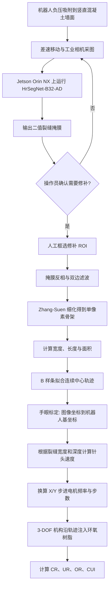
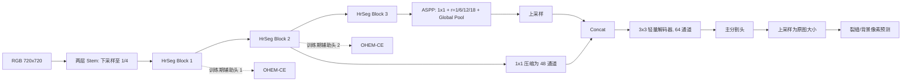
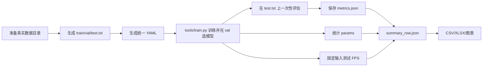

# IOIR 攀壁机器人论文与代码仓库复现分析

> 论文：Zhenqin Huang et al., *Integrated on-site inspection and repair wall-climbing robot of concrete cracks*, Automation in Construction 188 (2026) 107006. DOI: 10.1016/j.autcon.2026.107006。
>
> 分析范围：论文全文、`PaddleSeg-release-2.8` 中的模型实现、训练配置、数据清单、离线实验脚本、单元测试与现有输出目录。

## 1. 先给结论

这篇论文不是一篇纯粹的裂缝分割算法论文，而是一篇机器人系统集成论文。它真正的主线是：

1. 用负压吸附攀壁机器人到达高处混凝土表面；
2. 用轻量语义分割网络生成像素级裂缝掩膜；
3. 由人工确认是否修补并选择 ROI；
4. 从掩膜提取骨架、宽度、长度和面积，再生成 B 样条修补轨迹；
5. 将轨迹映射到三轴修补机构并控制环氧树脂挤出；
6. 用裂缝测宽误差和修补覆盖质量验证闭环效果。

算法贡献只是系统贡献的一部分。视觉模型名为 **HrSegNet-B32-AD**，以 HrSegNet-B32 为基线，`A` 表示 ASPP 多尺度上下文模块，`D` 表示重新设计的轻量解码器。训练阶段另外使用两个辅助头做深监督，但推理时移除辅助输出。

当前仓库不能直接复现论文结果，原因有四个：

- 论文使用 PyTorch 2.5.1，仓库主模型实现使用 PaddlePaddle/PaddleSeg；
- 论文称私有数据集有 1251 张、按 7:1:1 划分且不做增强，仓库清单有 1772 条、按 1418/177/177 划分并启用了多种增强；
- 仓库只保存了数据清单，没有实际图像和标签；
- 仓库没有最终模型权重、测试 `metrics.json` 或论文结果汇总，现有 VisualDL 日志不能替代完整复现实验。

因此，这个仓库更准确的定位是：**基于 PaddleSeg 重建并扩展论文视觉部分的实验工程**，而不是论文作者原始 PyTorch 代码的完整开源版本。

## 2. 研究背景与要解决的问题

### 2.1 应用背景

高层建筑、桥梁、坝体等混凝土基础设施长期受到环境和荷载作用，表面裂缝会促进水分侵入与钢筋腐蚀。传统流程通常是先由人员或机器人巡检，之后再搭脚手架、吊篮或部署另一套设备进行修补。

这种“检测与修补分离”的模式存在三个痛点：

- 高空人工操作危险、耗时、成本高；
- 检测后还需要再次组织人员和设备，存在重复进场成本；
- 检测到修补之间有时间延迟，裂缝可能继续发展。

地面机器人承载能力强但到不了垂直高处；无人机机动性好，但续航、负载和接触稳定性不足，难以持续施加修补材料。壁虎机器人能贴近墙面并保持接触，因此适合把检测和修补合并到同一平台。

### 2.2 论文定义的核心问题

论文要解决的不是简单的“有没有裂缝”，而是下面这个闭环问题：

> 如何在计算资源受限的攀壁机器人上，稳定地获得足够精细的裂缝像素几何信息，并把这些信息实时转换为可执行的修补轨迹，最后在真实竖直混凝土墙面完成封缝？

这里包含五个相互耦合的子问题：吸附与移动稳定性、轻量裂缝分割、相机到修补机构的坐标标定、裂缝骨架到连续轨迹的转换、修补质量的定量评估。

### 2.3 论文的四项自述贡献

1. 构建单平台的检测、任务生成与修补系统；
2. 提出轻量实时分割网络 HrSegNet-B32-AD；
3. 构建 3-DOF 修补机构以及从像素裂缝到执行轨迹的转换方法；
4. 提出 CR、UR、OR、CUI 四个像素级修补质量指标。

“首个完整集成平台”是作者自述，复写新论文时应改成可核查的限定表达，不宜直接沿用绝对优先权措辞。

## 3. 系统总流程



该系统不是端到端全自主系统。修补决策和 ROI 选择由操作员完成，因此更准确的类别是 **human-in-the-loop 半自主闭环系统**。

## 4. HrSegNet-B32-AD 算法原理

### 4.1 它属于什么训练任务

- 学习范式：有监督学习；
- 视觉任务：二分类语义分割，不是目标检测；
- 标签粒度：像素级，类别为背景和裂缝；
- 网络类型：轻量 CNN 编码器-解码器；
- 优化方式：主头加两个辅助头的深监督；
- 难样本策略：OHEM Cross Entropy，重点优化细裂缝、低对比度区域和边界像素。

### 4.2 基础模型 HrSegNet-B32

基础模型来自参考文献 [35]：Li et al., “Real-time high-resolution neural network with semantic guidance for crack segmentation”, *Automation in Construction*, 2023。

HrSegNet 的关键思想是双路径：

- 高分辨率路径始终保留较细的空间信息，避免细裂缝在连续下采样中消失；
- 语义引导路径通过更低分辨率、更宽通道获得上下文，再上采样回高分辨率路径并逐级相加；
- 三个 HrSeg block 串联，训练时在中间层挂两个辅助分割头。

仓库基线实现位于 `paddleseg/models/hrsegnet_b32.py`。输入先经两次步长为 2 的卷积降到原图 1/4，之后三个 `SegBlock` 的高分辨率支路保持空间尺度；每个块的低分辨率特征经过 `1x1` 卷积与双线性上采样后回注高分辨率支路。

### 4.3 三项改动

#### A. ASPP 多尺度上下文

ASPP 同时包含 `1x1` 卷积、不同膨胀率的 `3x3` 空洞卷积和全局平均池化分支。论文最终给出的膨胀率是 `{1, 6, 12, 18}`，输出通道数为 64。

作用是用不同感受野同时识别细裂缝、宽裂缝、分叉和断续结构。仓库实现还额外保留普通 `1x1` 分支与全局池化分支，因此实际拼接分支数是 `len(rates)+2`。

#### D. 轻量解码器

ASPP 输出提供高级语义，较早的 `hrseg2_out` 经过 `1x1` 卷积压到 48 通道，二者在同一分辨率拼接，再经一个 64 通道 `3x3 Conv + BN + ReLU + Dropout(0.1)` 细化，最后送入分割头。

其作用是恢复 ASPP 语义特征中丢失的边界和局部几何细节。

#### 辅助头与深监督

两个辅助头分别连接前两个 HrSeg block。总损失为：

```text
L_total = L_main + 0.5 * L_aux1 + 0.5 * L_aux2
```

三项均使用 OHEM-CE。辅助头只在训练阶段返回，推理阶段只保留主头，所以不会增加部署时的计算路径。

### 4.4 网络数据流



原论文网络结构图见 [核心阅读稿](reader/paper.md#F002)。

## 5. 训练设置：论文与仓库必须分开看

| 项目 | 论文原始描述 | 仓库当前设置 | 复现判断 |
|---|---|---|---|
| 框架 | Python 3.12.3, PyTorch 2.5.1 | PaddleSeg 2.8 风格的 Paddle 实现 | 不是同一训练实现 |
| GPU | RTX 4070 12 GB | 当前机器 RTX 5060 8 GB | 批量 8 可能需降为 4 或用梯度累积 |
| CPU/RAM | AMD Ryzen 9 7900X, 32 GB | 当前环境未绑定论文硬件 | CPU 对结果影响小，吞吐测试需单独标注 |
| CUDA/cuDNN | CUDA 12.4, cuDNN 9.1.0 | 仓库环境未固定；旧 `.venv` 已失效 | 需重建环境 |
| 私有数据 | 1251 张，720x720，机器人实采，像素标注 | 清单共 1772 条：1418/177/177 | 数据版本不一致 |
| 数据划分 | 7:1:1 | 约 8:1:1 | 无法逐项对齐 |
| 数据增强 | 明确写“无增强” | 缩放、随机裁剪、翻转、亮度/对比度/饱和度扰动 | 明显 protocol 偏差 |
| Batch size | 未说明 | 8 | 只能视作仓库假设 |
| 训练长度 | 未说明 | 18000 iterations | 只能视作仓库假设 |
| 优化器 | 未说明 | SGD, momentum 0.9, weight decay 5e-4 | 只能视作仓库假设 |
| 学习率 | 未说明 | Poly decay, 初始 0.01, power 0.9, warmup 1000 | 只能视作仓库假设 |
| 损失 | 深监督 OHEM-CE，权重 1/0.5/0.5 | 对应三项 OHEM-CE | 这一项基本对齐 |
| 随机种子 | 未说明 | 公共 PyTorch benchmark 设置为 42，Paddle 主训练未统一固定 | 不能做方差分析 |

论文缺失 batch size、optimizer、learning rate、训练轮数/迭代数、随机种子、模型选择规则、归一化参数和 Crack500 的具体划分。即使拿到私有数据，也无法仅靠论文完全复现实验。

论文写的 `7:1:1` 总和为 9，不是常见的 7:1:2 或 8:1:1。若严格理解为 7/9、1/9、1/9，1251 张也不能整除，具体样本数仍不明确，应向作者索取 split 文件。

## 6. 评价指标及其口径

### 6.1 分割指标

论文统计像素级 TP、FP、FN、TN：

```text
Precision = TP / (TP + FP)
Recall    = TP / (TP + FN)
F1        = 2TP / (2TP + FP + FN)
IoU_crack = TP / (TP + FP + FN)
mIoU      = (IoU_crack + IoU_background) / 2
```

对细裂缝任务，背景像素远多于裂缝像素，所以仅看 mIoU 容易掩盖前景性能。论文同时报告 crack IoU 是正确方向。仓库的统一评估脚本进一步输出前景 IoU、Dice、Precision、Recall、F1、mIoU、mDice、accuracy 与 kappa，其中论文表格的 F1 与 Dice 在二分类前景上是同一公式。

复现时主指标建议固定为 `foreground IoU + foreground F1`，mIoU 作为辅助指标，并额外报告参数量、FLOPs、真实设备 FPS 和显存峰值。论文只报告参数量，没有给 HrSegNet-B32-AD 在 Jetson Orin NX 上的 FPS/延迟，因此“实时”和“最优精度-效率平衡”证据并不完整。

### 6.2 裂缝几何指标

相机固定工作距离 200 mm，4024x3036 工业相机配 8 mm 镜头。使用 12x9、格长 3 mm 的棋盘格，在 18 个姿态做手眼标定，得到：

- 物理分辨率 0.045 mm/pixel；
- 平均重投影误差 0.31 pixel；
- 平均坐标映射误差 0.43 mm。

几何计算逻辑：骨架到边界的最大欧氏距离乘 2 得最大裂缝宽度；相邻骨架点距离累加得长度；裂缝像素数乘 `delta^2` 得面积。

### 6.3 修补质量指标

- CR：原裂缝区域中被胶覆盖的比例；
- UR：原裂缝区域中未被胶覆盖的比例，理论上 `UR = 1 - CR`；
- OR/OFR：胶体区域中落到裂缝外部的比例；
- CUI：沿骨架局部覆盖率的均匀程度，越接近 1 越均匀。

论文正文称 `OR`，公式标签写成 `OFR`，属于符号不一致。新论文应统一一个名字。

## 7. 消融实验

私有数据集上的表 3：

| 变体 | Precision | Recall | F1 | Crack IoU | mIoU | Params |
|---|---:|---:|---:|---:|---:|---:|
| HrSegNet-B32 | 85.2 | 82.7 | 84.0 | 72.4 | 85.7 | 2.43 M |
| + ASPP | 86.2 | 83.4 | 84.8 | 73.7 | 86.3 | 2.55 M |
| + Decoder | 84.5 | 84.1 | 84.3 | 72.9 | 85.9 | 2.49 M |
| + ASPP + Decoder | 84.9 | 86.9 | 85.9 | 75.3 | 87.1 | 2.61 M |

相对基线的解释：

- ASPP 单独加入后，Precision +1.0、F1 +0.8、IoU +1.3，说明多尺度上下文主要减少误检并改善整体区域匹配；
- Decoder 单独加入后，Recall +1.4、F1 +0.3、IoU +0.5，说明低层细节融合更偏向找回漏掉的细裂缝；
- 两者同时加入后，Recall +4.2、F1 +1.9、IoU +2.9，但 Precision 比基线低 0.3，说明最终模型用较多前景预测换取更少漏检；
- 参数量只增加 0.18 M，结构增益相对轻量。

论文另称调参后的 `{1,6,12,18}, c=64` 达到 Precision 84.9、Recall 86.9、F1 85.28、mIoU 86.67、2.62 M 参数。这个描述与表 3 的 F1 85.9、mIoU 87.1、2.61 M 不一致，不能简单解释为相同精度的四舍五入。正式复现前应确定哪一组来自最终 test set，哪一组可能来自 validation 或另一轮训练。

仓库后来扩展了三组通道宽度 `B16/B32/B64`，每组都有 `baseline/ASPP/decoder/final` 四种结构，还支持 ASPP dilation 与输出通道的网格搜索。这些扩展实验并未出现在论文表 3 中。

## 8. 公共数据集基线对比

论文在 Crack500 上报告：

| 模型 | Precision | Recall | F1 | Crack IoU | mIoU | Params |
|---|---:|---:|---:|---:|---:|---:|
| PSPNet | 80.0 | 59.9 | 68.5 | 52.2 | 74.1 | 21.1 M |
| DeepCrack | 67.6 | 77.0 | 72.0 | 56.3 | 75.9 | 14.7 M |
| EfficientNet | 73.3 | 75.4 | 74.3 | 59.2 | 77.6 | 6.98 M |
| MobileNetV3 | 74.9 | 74.7 | 74.8 | 59.7 | 78.0 | 1.06 M |
| ShuffleNetV2 | 75.5 | 76.3 | 75.9 | 61.2 | 78.8 | 1.38 M |
| SegFormer-B0 | **80.3** | **77.8** | **79.0** | **65.3** | **81.1** | 3.71 M |
| HrSegNet-B32-AD | 79.1 | 74.5 | 76.8 | 60.5 | 79.4 | 2.61 M |

正确结论是：

- SegFormer-B0 的所有精度指标都最好；
- HrSegNet-B32-AD 的参数量比 SegFormer-B0 少约 29.6%，但 F1 低 2.2 个百分点、Crack IoU 低 4.8 个百分点；
- HrSegNet-B32-AD 的 mIoU 高于 EfficientNet、MobileNetV3、ShuffleNetV2，但 Crack IoU 低于 ShuffleNetV2；
- MobileNetV3 和 ShuffleNetV2 参数更少，因此 HrSegNet-B32-AD 不是最轻模型；
- 在没有 FPS、FLOPs、延迟和功耗的情况下，只能说它位于一个有竞争力的折中点，不能严格证明“最优平衡”。

### 8.1 为什么选这些模型

论文没有交代系统化检索或基线筛选流程。根据模型类别，可以推断作者意图覆盖：

- PSPNet：较重的多尺度金字塔 CNN；
- DeepCrack：裂缝专用经典网络；
- EfficientNet：高效 CNN 缩放路线；
- MobileNetV3、ShuffleNetV2：移动端轻量 CNN；
- SegFormer-B0：轻量 Transformer 分割模型。

这形成“任务专用模型、通用重模型、轻量 CNN、Transformer”四类对照。仓库中的 EfficientNet、MobileNetV3、ShuffleNetV2、DeepCrack 源码来自随仓库附带的官方 LMM PyTorch 工程；PSPNet、UNet、SegFormer 则走 PaddleSeg 配置。不同框架混跑时必须统一输入、划分、损失、训练预算、预训练策略和模型选择规则，否则表格不构成严格公平对比。

## 9. 轨迹生成与执行算法

论文算法从分割掩膜到执行指令的顺序是：

1. 相机内参由 Zhang 标定法获得；
2. 手眼标定得到相机坐标系到机器人基坐标系的固定变换；
3. 操作员选择 ROI，降低纹理误检导致错误注胶的风险；
4. 掩膜反相、双边滤波、Zhang-Suen 细化；
5. 从骨架和边界估计宽度、长度、面积；
6. 使用 B 样条将离散骨架拟合为连续轨迹；
7. 根据 `v(s) = Q / (k * w(s) * h(s))` 调节针头速度；
8. 将速度分解为 X/Y 分量，再乘电机脉冲当量得到步进频率；
9. 位移乘脉冲当量并取整得到步数。

材料为高流动性环氧树脂，初始黏度 360 mPa*s、固化约 2 h；针头外径 1.9 mm；流量 `Q=40 mm^3/s`；经验系数 `k=1.8`，用于主动过填充；实验中的名义插入深度为 2 mm。

原论文任务生成图见 [核心阅读稿](reader/paper.md#F003)。

## 10. 机器人硬件与部署

### 10.1 自研与开源边界

- 自研：整机结构、负压吸附机构、3-DOF 修补机构、系统集成、GUI、标定与任务生成流程；
- 商用部件：HIKROBOT 工业相机和镜头、Jetson Orin NX、STM32F407 控制板、A4988 步进驱动、风机、电机等；
- 基础算法：HrSegNet、ASPP、Zhang 标定、Zhang-Suen 细化、B 样条等均基于已有公开方法；
- 框架：PaddleSeg 为 Apache 2.0 开源框架；仓库附带的 LMM 子工程自称为其论文官方实现；
- 数据：Crack500/CrackSeg9K 是公开数据，论文 1251 张机器人实采数据是自建数据，论文只写“可向作者索取”，并未随当前仓库开放。

### 10.2 关键设备

- 部署计算：Jetson Orin NX 16GB Super，最高 GPU 频率 1173 MHz，标称 AI 性能 157 TOPS；
- 训练计算：RTX 4070 12GB、AMD Ryzen 9 7900X、32GB RAM；
- 相机：HIKROBOT MV-CU120-10GM，4024x3036，像元 1.85 um；
- 镜头：8 mm、f/1.8；
- 整机：约 30x25x10 cm、2.30 kg、载荷 2 kg；
- 修补工作空间：55x55x35 mm；
- 表 2 标称爬行速度 0.10 m/s，而实验命令速度写为 0.15 m/s，两处口径需区分。

## 11. 物理实验如何做、结果如何

### 11.1 吸附与运动

- 场地：3.0x5.0 m 真实混凝土墙，使用自然裂缝而不是预制裂缝；
- 机器人在墙上向上和向下各运动 2.0 m；
- 命令速度 0.15 m/s，每个方向重复 5 次；
- 实测速度与命令值偏差不超过 4.8%；
- 同向和反向差速转弯做了定性展示，但没有给转向误差、轨迹 RMSE 或成功率。

### 11.2 裂缝测宽

人工参考由 150x 裂缝显微镜测量，每个点重复 3 次取均值。A、B 两组各 10 个样本：

- A 组：论文称为主要工作范围 `>2 mm`，AE 0.53%，MSE 0.46%²；
- B 组：论文称 `<2 mm`，AE 1.49%，MSE 3.08%²。

但 B4=2.33 mm、B7=2.14 mm，实际并非全部 `<2 mm`。此外样本只有 20 个点，结果应表述为“当前条件下的初步几何精度”，不宜推广为跨场景精度。

### 11.3 端到端修补

论文只选取 5 个代表性任务：平均 CR 98.6%、UR 1.4%、OR 52.8%、CUI 96.8%。

CR 很高说明原裂缝基本被覆盖，CUI 高说明沿裂缝方向较均匀；但 OR 平均 52.8% 表示超过一半的胶体像素位于原裂缝区域之外，过填充相当明显。作者将 `k=1.8` 设计为主动过填充以避免内部空洞，但新论文若沿用该策略，应同时讨论材料浪费、表面外观、后处理成本和长期耐久性。

## 12. 仓库核心代码地图

| 目的 | 文件 | 说明 |
|---|---|---|
| 论文基线 | `paddleseg/models/hrsegnet_b32.py` | HrSegNet-B32 双路径与两个辅助头 |
| 论文改进模型 | `paddleseg/models/hrsegnet_b64_asppde.py` | 实际注册类名 `HrSegNet_Lite`，包含 ASPP 与轻量解码器，文件名有误导性 |
| 统一消融模型 | `paddleseg/models/hrsegnet_b16_ablation.py` | 用开关生成 ASPP-only、Decoder-only、Final；类名虽有 B16，但 `base` 可设 32/64 |
| 论文式最终配置 | `configs/aa/hrsegnetb32_asppdelite.yml` | batch 8、18000 iter、720 crop、SGD、OHEM-CE、Poly LR |
| 消融配置生成 | `scripts/offline_experiments/generate_ablation_configs.py` | 统一训练策略并生成 B16/B32/B64 四组结构 |
| 消融流水线 | `scripts/offline_experiments/run_ablation.py` | 训练、test 评估、参数量、FPS、汇总 |
| 公共数据对比 | `scripts/offline_experiments/run_crack500.py` | 在同一 Crack500 清单上运行 Paddle 模型 |
| 跨框架基线 | `torch_crack_benchmark/` | PyTorch 模型适配、训练、评估、早停、FPS |
| 指标实现 | `scripts/offline_experiments/evaluate_experiment.py` | 聚合整套测试集像素混淆矩阵并输出前景指标 |
| 数据准备 | `scripts/offline_experiments/prepare_datasets.py` | 生成 split 清单并将压缩掩膜二值化 |
| 原始对比源码 | `Lightweight-Modular-Model-main/Codes/` | DeepCrack、EfficientNet、MobileNetV3、ShuffleNetV2 等 PyTorch 实现 |

仓库设计的实验闭环是：



这个设计方向正确：验证集用于模型选择，测试集用于最终汇报，且测试指标由数据集标签产生，不是由模型输出自造 ground truth。

## 13. 当前仓库可复现性审计

### 13.1 已具备

- 模型结构、损失权重和主要超参数配置；
- B16/B32/B64 的模块消融生成器；
- 公共数据适配器、测试集评估、参数量与 FPS 脚本；
- 配置生成、数据准备和汇总相关单元测试；
- Crack500、CrackSeg9K、Crack500-Kaggle 的 split 清单。

### 13.2 缺失或不一致

- 所有清单引用的真实图像和标签均不存在；
- 私有数据数量与论文不一致；
- 论文是 PyTorch，核心仓库是 Paddle；
- 论文不增强，仓库增强；
- 没有论文训练的随机种子和重复实验；
- 没有训练完成的 checkpoint、结构化测试指标、参数/FPS 汇总；
- `requirements.txt` 有 PaddleSeg，但没有明确固定 PaddlePaddle/CUDA 安装版本；
- 仓库 `.venv` 指向已不存在的 `E:\anaconda3\envs\cuda11-py310\python.exe`；
- 当前系统 Python 3.8，代码使用 `float | None` 和 `Path.write_text(newline=...)`，要求更高版本；
- 单元测试结果：offline 18 项中 15 通过、3 项因 Python 3.8 的 `newline` 参数失败；torch benchmark 3 项中 2 通过、1 项因 Python 3.8 不支持 `float | None` 失败；LMM original 4 项全部通过；
- `output/offline_experiments` 没有有效结果，仅有 40 字节的运行日志。

### 13.3 复现优先级

1. 向作者索取私有 1251 张数据、精确 split、原始 PyTorch 代码和最终 checkpoint；
2. 新建 Python 3.12 环境，分别维护“论文 PyTorch 环境”和“仓库 Paddle 环境”；
3. 先在 Crack500 上做 smoke test，验证标签值、输出尺寸和指标口径；
4. 严格论文 protocol 跑一次“无增强”实验；
5. 再跑仓库增强版，作为改进实验而不是论文复现结果；
6. 至少 3 个随机种子，报告均值和标准差；
7. 所有模型统一 split、图像尺寸、增强、训练预算、预训练策略和 checkpoint 选择；
8. 在 RTX 5060 与 Jetson Orin NX 分别报告训练吞吐和部署延迟，不混用硬件结果；
9. 保存每次运行的 YAML、commit/hash、环境锁文件、checkpoint、逐图预测和结构化指标。

## 14. 迁移成你们新论文的通用框架

你们可以复用这篇论文的“论证骨架”，但不要照搬算法或数据：

| 原论文角色 | 你们新论文需要替换的内容 |
|---|---|
| 高空混凝土裂缝维护 | 你们的具体应用痛点与作业对象 |
| 攀壁机器人 | 你们的载体、传感器或执行平台 |
| HrSegNet-B32 | 一个合理、公开、可复现的基础模型 |
| ASPP | 你们针对场景痛点设计的上下文/尺度模块 |
| 轻量 Decoder | 你们针对边界、细节或部署设计的恢复模块 |
| OHEM-CE | 与类别不平衡和边界难例匹配的损失 |
| 裂缝骨架与 B 样条 | 从感知结果到执行任务的中间表示和规划方法 |
| Crack500 对比 | 至少一个公开数据集做外部泛化验证 |
| CR/UR/OR/CUI | 与最终业务结果直接对应的闭环指标 |

推荐的论文实验矩阵：

1. **主结果**：你们模型与 5 到 7 个有代表性的基线在公开数据和自建数据上比较；
2. **模块消融**：Baseline、+模块 A、+模块 B、+A+B；
3. **超参数消融**：核心尺度、通道、阈值或损失权重；
4. **泛化实验**：跨数据集直接测试或少样本迁移；
5. **效率实验**：Params、FLOPs、GPU/边缘设备 FPS、延迟、显存、功耗；
6. **鲁棒性实验**：光照、噪声、材质、尺度、遮挡和设备变化；
7. **系统闭环实验**：感知误差如何影响定位、规划和最终任务质量；
8. **统计要求**：至少 3 个种子，均值、标准差、置信区间或显著性检验；
9. **失败案例**：展示误检、漏检和执行失败，并解释边界条件。

新论文最值得继承的是“从算法指标走到业务闭环指标”的思路。最需要补强的是严格的可复现训练 protocol、公平基线、真实端侧速度、多次重复实验和更大规模的系统验证。

## 15. 术语表

| 术语 | 统一含义 |
|---|---|
| IOIR | Integrated On-site Inspection and Repair，现场检测-修补一体化系统 |
| HrSegNet-B32-AD | B32 通道基线加 ASPP 和轻量 Decoder 的最终视觉模型 |
| ASPP | Atrous Spatial Pyramid Pooling，空洞空间金字塔池化 |
| OHEM-CE | Online Hard Example Mining Cross Entropy，在线难例挖掘交叉熵 |
| ROI | Region of Interest，操作员选择的修补区域 |
| CR | Coverage Rate，覆盖率 |
| UR | Underfill Rate，欠填率 |
| OR/OFR | Overflow Ratio，溢出率；论文命名不统一 |
| CUI | Coverage Uniformity Index，覆盖均匀性指数 |

## 16. 证据入口

- 论文原件：`../Climbing robot.pdf`
- 关键段落与图片锚点：`reader/paper.md`
- 模型主实现：`../PaddleSeg-release-2.8/paddleseg/models/hrsegnet_b64_asppde.py`
- 基线模型：`../PaddleSeg-release-2.8/paddleseg/models/hrsegnet_b32.py`
- 消融模型：`../PaddleSeg-release-2.8/paddleseg/models/hrsegnet_b16_ablation.py`
- 论文式配置：`../PaddleSeg-release-2.8/configs/aa/hrsegnetb32_asppdelite.yml`
- 实验运行器：`../PaddleSeg-release-2.8/scripts/offline_experiments/run_ablation.py`
- 统一评估：`../PaddleSeg-release-2.8/scripts/offline_experiments/evaluate_experiment.py`

