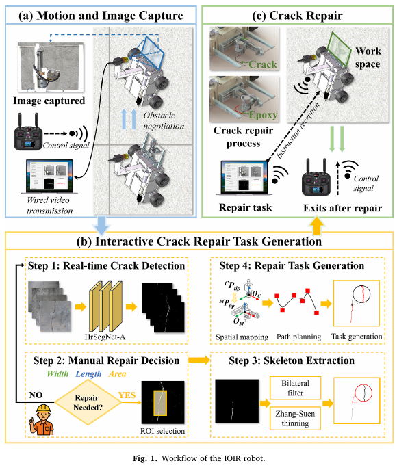
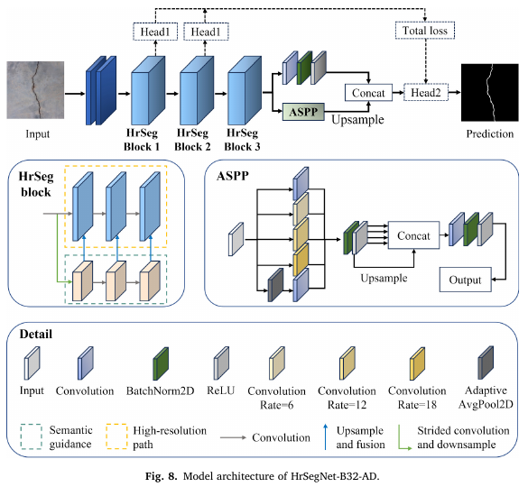
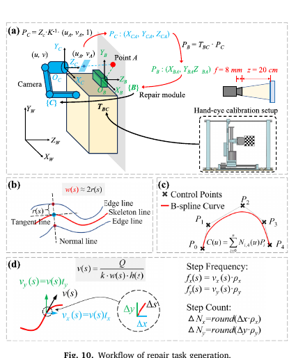

# 核心论文阅读稿（重点段落中英对照，Draft）

**Title:** Integrated on-site inspection and repair wall-climbing robot of concrete cracks  
**中文题名:** 混凝土裂缝现场检测与修补一体化攀壁机器人  
**Journal:** Automation in Construction 188 (2026) 107006  
**DOI:** 10.1016/j.autcon.2026.107006  
**Paper type:** 机器人系统与方法论文  
**Source format:** selectable-text PDF

> 本稿为支撑复现实验分析而制作的核心段落阅读稿，保留关键原文、中文释义、页码和图表锚点。它不是论文全文翻译；未纳入的机械推导、完整参考文献和逐段内容记录于 `translation_notes.md`。

## 页面与主题索引

| 页码 | 内容 |
|---|---|
| p.1-p.2 | 摘要、研究背景、问题缺口和贡献 |
| p.2-p.5 | IOIR 硬件架构、负压吸附和力学分析 |
| p.6-p.8 | HrSegNet-B32-AD、训练、消融、Crack500 对比 |
| p.8-p.9 | 标定、骨架、B 样条和运动参数生成 |
| p.9-p.12 | 全尺寸墙面、运动、测宽和修补实验 |
| p.13 | 结论与局限 |

## 术语表

| Canonical term | First-use definition | 中文统一译法 |
|---|---|---|
| IOIR | Integrated On-site Inspection and Repair | 现场检测-修补一体化系统 |
| HrSegNet-B32-AD | HrSegNet-B32 with ASPP and redesigned Decoder | 加 ASPP 与轻量解码器的 HrSegNet-B32 |
| OHEM-CE | online hard example mining cross-entropy | 在线难例挖掘交叉熵 |
| CR | coverage rate | 覆盖率 |
| UR | underfill rate | 欠填率 |
| OR | overflow ratio | 溢出率 |
| CUI | coverage uniformity index | 覆盖均匀性指数 |

## 摘要：问题与方案

**Source:** p.1 S001

**Original:** Concrete infrastructure maintenance for vertical structures remains constrained by the separation between crack inspection and manual repair, which is labor-intensive, hazardous, and inefficient. This paper presents an integrated on-site inspection and repair wall-climbing robot (IOIR) for concrete cracks, combining crack detection, quantification, task generation, and robotic sealing within a unified workflow.

**中文:** 竖直混凝土结构的维护仍受到“裂缝检测与人工修补相互分离”的限制，这种方式劳动强度高、危险且效率低。本文提出混凝土裂缝现场检测与修补一体化攀壁机器人 IOIR，将裂缝检测、定量分析、任务生成和机器人封缝合并到统一流程中。

## 摘要：系统组成与结果

**Source:** p.1 S002

**Original:** The robot integrates negative-pressure adhesion, a modular climbing mechanism, an onboard lightweight HrSegNet-B32-AD segmentation network, and a compact 3-DOF repair module. Pixel-wise crack masks generated onboard support accurate geometric measurement and automated repair trajectory planning for sealing.

**中文:** 机器人集成负压吸附、模块化攀爬机构、板载轻量 HrSegNet-B32-AD 分割网络和紧凑型三自由度修补模块。板载生成的像素级裂缝掩膜用于精确几何测量，并支持封缝轨迹自动规划。

## 研究空白

**Source:** p.2 S003

**Original:** Therefore, a practical wall-climbing maintenance system requires a lightweight and accurate segmentation method that can support real-time onboard inference while preserving sufficient geometric information for autonomous repair execution.

**中文:** 因此，实用的攀壁维护系统需要一种兼顾轻量与精度的分割方法，在支持板载实时推理的同时，保留足够的几何信息以执行自动修补。

## 论文贡献

**Source:** p.2 S004

**Original:** The proposed system combines visual crack perception, crack-based task generation, and localized sealing within a unified workflow for vertical concrete surfaces.

**中文:** 所提系统面向竖直混凝土表面，将视觉裂缝感知、基于裂缝的任务生成和局部封缝合并为统一工作流。

### Fig. 1. IOIR 总体流程

**Placed near:** p.2 S004  
**Source:** p.3 C001

**Original caption:** Fig. 1. Workflow of the IOIR robot.

**中文图注:** 图 1. IOIR 机器人的工作流程。

**Reading note:** 上部是采图与修补硬件，下部是人工参与的裂缝检测、决策、ROI、骨架和任务生成。该图直接证明系统并非完全自主。

## 基础网络与问题

**Source:** p.6 S005

**Original:** The baseline HrSegNet adopts a dual-path architecture, in which the high-resolution branch preserves fine spatial details while the semantic-guidance branch captures high-level contextual information. However, the original feature fusion mechanism is not sufficiently effective for modeling multi-scale crack patterns.

**中文:** 基线 HrSegNet 采用双路径结构：高分辨率分支保留精细空间细节，语义引导分支提取高级上下文。然而，原始特征融合机制对多尺度裂缝模式的建模仍不充分。

## ASPP 与解码器改进

**Source:** p.6 S006

**Original:** HrSegNet-B32-AD was developed by introducing an Atrous Spatial Pyramid Pooling (ASPP) module and a redesigned decoder. The ASPP module aggregates multi-scale contextual information through parallel dilated convolutions with different receptive fields. The redesigned decoder then fuses the high-level semantic features from ASPP with low-level spatial details from earlier encoder stages through skip connections.

**中文:** HrSegNet-B32-AD 引入 ASPP 模块和重新设计的解码器。ASPP 通过具有不同感受野的并行空洞卷积聚合多尺度上下文；解码器再通过跳跃连接，将 ASPP 的高级语义与编码器早期阶段的低级空间细节融合。

## 深监督损失

**Source:** p.6 S007

**Original:** The network was trained using a deep-supervised OHEM-CE loss. The overall loss is defined as Ltotal = Lmain + 0.5Lavx1 + 0.5Lavx2. The auxiliary heads are used only during training and are removed during inference.

**中文:** 网络使用深监督 OHEM-CE 损失训练，总损失为主头损失加两个权重为 0.5 的辅助头损失。辅助头仅在训练中使用，推理时移除，因此不增加运行时路径。

### Fig. 8. HrSegNet-B32-AD 网络结构

**Placed near:** p.6 S006  
**Source:** p.7 C002

**Original caption:** Fig. 8. Model architecture of HrSegNet-B32-AD.

**中文图注:** 图 8. HrSegNet-B32-AD 的模型结构。

**Reading note:** 重点看三个 HrSeg block、ASPP、多尺度分支、低层特征拼接，以及两个训练期辅助头。

## 数据与训练环境

**Source:** p.6-p.7 S008

**Original:** The dataset contains 1251 crack images with a resolution of 720 x 720 pixels, all captured by the wall-climbing robot under varying illumination and surface-texture conditions. The dataset was divided into training, validation, and test sets with a ratio of 7:1:1. No data augmentation was applied in training.

**中文:** 数据集包含 1251 张 720x720 裂缝图像，均由攀壁机器人在不同光照和表面纹理条件下采集。数据按 7:1:1 划分为训练、验证和测试集，训练时不使用数据增强。

**Original:** All deep learning models were trained on a workstation equipped with 32 GB RAM, an AMD Ryzen 9 7900X CPU, and an NVIDIA RTX 4070 GPU with 12 GB VRAM. The models were implemented in Python 3.12.3 using PyTorch 2.5.1, with CUDA 12.4 and cuDNN 9.1.0.

**中文:** 所有深度学习模型在 32 GB 内存、AMD Ryzen 9 7900X CPU 和 12 GB 显存 RTX 4070 GPU 的工作站上训练，软件为 Python 3.12.3、PyTorch 2.5.1、CUDA 12.4 和 cuDNN 9.1.0。

## 消融结论

**Source:** p.7 S009

**Original:** ASPP improves multi-scale contextual perception, while the redesigned decoder enhances the recovery of fine crack structures. Their combination achieves the best overall balance between accuracy and efficiency.

**中文:** ASPP 改善多尺度上下文感知，重新设计的解码器增强细裂缝结构恢复，两者组合取得最佳总体精度与效率折中。

## Crack500 对比结论

**Source:** p.7-p.8 S010

**Original:** Although slightly trailing SegFormer-B0 in raw accuracy, our model is significantly lighter and consistently outperforms conventional lightweight CNNs, such as EfficientNet and MobileNetV3, across F1-score, IoU, and mIoU metrics.

**中文:** 虽然原始精度略低于 SegFormer-B0，但作者模型参数更少，并在 F1、IoU 和 mIoU 上超过 EfficientNet 与 MobileNetV3 等传统轻量 CNN。

## 修补任务生成

**Source:** p.8-p.9 S011

**Original:** Following operator-assisted ROI selection, the crack mask is extracted, inverted, denoised using a bilateral filter, and thinned by the Zhang-Suen algorithm to obtain a one-pixel-wide skeleton. To ensure smooth motion, the discrete skeleton is fitted with a B-spline curve.

**中文:** 操作员辅助选择 ROI 后，系统提取并反相裂缝掩膜，使用双边滤波去噪，再用 Zhang-Suen 算法细化为单像素骨架。为保证运动平滑，离散骨架进一步用 B 样条拟合。

### Fig. 10. 修补任务生成

**Placed near:** p.8 S011  
**Source:** p.8 C003

**Original caption:** Fig. 10. Workflow of repair task generation.

**中文图注:** 图 10. 修补任务生成流程。

**Reading note:** 四个子图依次表示坐标映射、裂缝宽度几何、B 样条路径和电机速度/步数换算。

## 全尺寸实验场地

**Source:** p.9 S012

**Original:** A prototype system was developed and tested on a full-scale concrete wall measuring 3.0 m x 5.0 m. The wall contained natural cracks of varying widths and orientations, rather than artificially prefabricated defects under small-scale laboratory conditions.

**中文:** 原型系统在 3.0 m x 5.0 m 的全尺寸混凝土墙上测试。墙面包含宽度和方向各异的自然裂缝，而不是小尺度实验室中人工预制的缺陷。

## 裂缝测宽结果

**Source:** p.10-p.11 S013

**Original:** For Group A, the algorithm achieved an Average Error (AE) of 0.53%... For the more challenging Group B samples, the algorithm maintained a relatively low AE of 1.49%.

**中文:** A 组的平均相对误差为 0.53%；更具挑战的 B 组平均相对误差为 1.49%。

## 修补质量结果

**Source:** p.11-p.12 S014

**Original:** Across the five representative repair tasks, the proposed system achieved a mean CR of 98.54%, a mean UR of 1.46%, a mean OR of 52.76%, and a mean CUI of 96.78%.

**中文:** 在 5 个代表性修补任务上，系统平均覆盖率为 98.54%，平均欠填率为 1.46%，平均溢出率为 52.76%，平均覆盖均匀性为 96.78%。

## 局限

**Source:** p.13 S015

**Original:** The repair module's applicability is currently constrained to cracks between 2 and 10 mm in width... overall automation is limited by the system's reliance on operator interaction for ROI selection and repair confirmation... the use of a single suction chamber for adhesion restricts the robot's capacity to traverse gaps and surface discontinuities.

**中文:** 修补模块目前只适用于 2 到 10 mm 宽的裂缝；ROI 选择与修补确认依赖操作员，限制了整体自动化；单吸附腔也限制了机器人跨越缝隙和表面不连续区域的能力。

## 阅读提示

- 论文最强的贡献是检测到执行的系统闭环，而不是 Crack500 上的分割 SOTA。
- 表 3 与正文对最终模型 F1、mIoU 和参数量的记录不一致。
- 论文称实时部署，但没有报告 Jetson Orin NX 的 FPS、延迟或功耗。
- 五次修补的覆盖率很高，但溢出率也高达约 52.8%，应同时看待。
- 当前系统仍需要人工确认与 ROI，不属于完全自主机器人。

